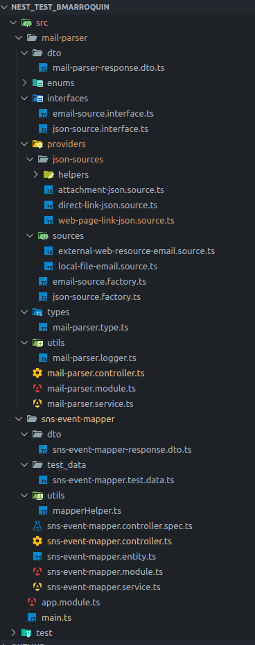

# NestJS Test Project - Brayan Marroquín

[](https://nestjs.com/)
[](https://www.typescriptlang.org/)
[](https://nodejs.org/)

This is my test project developed with [NestJS](https://nestjs.com/), a progressive Node.js framework for building efficient and scalable server-side applications.

## 📋 Table of Contents

- [NestJS Test Project - Brayan Marroquín](#nestjs-test-project---brayan-marroquín)
  - [📋 Table of Contents](#-table-of-contents)
  - [📖 Description](#-description)
  - [✨ Features](#-features)
  - [🔧 Prerequisites](#-prerequisites)
  - [📦 Installation](#-installation)
  - [⚙️ Configuration (optional)](#️-configuration-optional)
  - [🚀 Running the Application](#-running-the-application)
    - [Development Mode](#development-mode)
    - [Production Mode](#production-mode)
    - [Other useful commands](#other-useful-commands)
  - [🌐 API Endpoints](#-api-endpoints)
    - [Base URL](#base-url)
    - [SNS Event Mapper](#sns-event-mapper)
      - [POST `/sns-event-mapper`](#post-sns-event-mapper)
    - [Mail Parser](#mail-parser)
      - [GET `/mail-parser`](#get-mail-parser)
    - [HTTP Status Codes](#http-status-codes)
    - [Error Response Example](#error-response-example)
  - [🧪 Testing](#-testing)
    - [Unit Tests](#unit-tests)
    - [Test Coverage](#test-coverage)
  - [📁 Project Structure](#-project-structure)
  - [🛠️ Technologies Used](#️-technologies-used)
  - [📦 Main Dependencies](#-main-dependencies)
  - [📝 Available Scripts](#-available-scripts)
  - [👨‍💻 Author](#-author)
  - [📄 License](#-license)
  - [📚 Additional Resources](#-additional-resources)

## 📖 Description

This is a technical test project that demonstrates NestJS capabilities for creating robust and scalable RESTful APIs. The project implements development best practices, including modular architecture, dependency injection, and testing.

This project involves both exercises.

## ✨ Features

- 🏗️ **Modular Architecture**: Organized structure with reusable modules
- 🧪 **Testing**: Configured unit and e2e tests
- 🔄 **Restful API**: Post and Get operations
- ⚡ **Fast Development**: Hot-reload enabled in development mode

## 🔧 Prerequisites

Before you begin, make sure you have installed:

- [Node.js](https://nodejs.org/) (version 16.x or higher)
- [npm](https://www.npmjs.com/) (version 8.x or higher) or [yarn](https://yarnpkg.com/)
- [Git](https://git-scm.com/)

## 📦 Installation

1. **Clone the repository**

```bash
git clone https://github.com/Branux-sv/nest_test_bmarroquin.git
cd nest_test_bmarroquin
```

2. **Install dependencies**

```bash
npm install
```

## ⚙️ Configuration (optional)

1. **Environment variables**

Create a `.env` file in the project root:

```env
# Application
PORT=3000
NODE_ENV=development
```

## 🚀 Running the Application

### Development Mode

```bash
npm run start:dev
```

The application will be available at `http://localhost:3000`

### Production Mode

```bash
# Build the project
npm run build

# Run in production
npm run start:prod
```

### Other useful commands

```bash
# Development without watch mode
npm run start

# Debug mode
npm run start:debug
```

## 🌐 API Endpoints

### Base URL
```
http://localhost:3000/api/v1
```
### SNS Event Mapper

#### POST `/sns-event-mapper`
Gets a mapped JSON as response based on a SNS event as input

**Request Body:**
```json
{
  "Records": [
    {
      "eventVersion": "1.0",
      "ses": {
        "receipt": {
          "timestamp": "2015-09-11T20:32:33.936Z",
          "processingTimeMillis": 1000,
          "recipients": [
            "recipient@example.com"
          ],
          "spamVerdict": {
            "status": "PASS"
          },
          "virusVerdict": {
            "status": "PASS"
          },
          "spfVerdict": {
            "status": "PASS"
          },
          "dkimVerdict": {
            "status": "PASS"
          },
          "dmarcVerdict": {
            "status": "PASS"
          },
          "dmarcPolicy": "reject",
          "action": {
            "type": "SNS",
            "topicArn": "arn:aws:sns:us-east-1:012345678912:example-topic"
          }
        },
        "mail": {
          "timestamp": "2015-09-11T20:32:33.936Z",
          "source": "61967230-7A45-4A9D-BEC9-87CBCF2211C9@example.com",
          "messageId": "d6iitobk75ur44p8kdnnp7g2n800",
          "destination": [
            "recipient@example.com"
          ],
          "headersTruncated": false,
          "headers": [
            {
              "name": "Return-Path",
              "value": "<0000014fbe1c09cf-7cb9f704-7531-4e53-89a1-5fa9744f5eb6-000000@amazonses.com>"
            },
            {
              "name": "Received",
              "value": "from a9-183.smtp-out.amazonses.com (a9-183.smtp-out.amazonses.com [54.240.9.183]) by inbound-smtp.us-east-1.amazonaws.com with SMTP id d6iitobk75ur44p8kdnnp7g2n800 for recipient@example.com; Fri, 11 Sep 2015 20:32:33 +0000 (UTC)"
            },
            {
              "name": "DKIM-Signature",
              "value": "v=1; a=rsa-sha256; q=dns/txt; c=relaxed/simple; s=ug7nbtf4gccmlpwj322ax3p6ow6yfsug; d=amazonses.com; t=1442003552; h=From:To:Subject:MIME-Version:Content-Type:Content-Transfer-Encoding:Date:Message-ID:Feedback-ID; bh=DWr3IOmYWoXCA9ARqGC/UaODfghffiwFNRIb2Mckyt4=; b=p4ukUDSFqhqiub+zPR0DW1kp7oJZakrzupr6LBe6sUuvqpBkig56UzUwc29rFbJF hlX3Ov7DeYVNoN38stqwsF8ivcajXpQsXRC1cW9z8x875J041rClAjV7EGbLmudVpPX 4hHst1XPyX5wmgdHIhmUuh8oZKpVqGi6bHGzzf7g="
            },
            {
              "name": "From",
              "value": "sender@example.com"
            },
            {
              "name": "To",
              "value": "recipient@example.com"
            },
            {
              "name": "Subject",
              "value": "Example subject"
            },
            {
              "name": "MIME-Version",
              "value": "1.0"
            },
            {
              "name": "Content-Type",
              "value": "text/plain; charset=UTF-8"
            },
            {
              "name": "Content-Transfer-Encoding",
              "value": "7bit"
            },
            {
              "name": "Date",
              "value": "Fri, 11 Sep 2015 20:32:32 +0000"
            },
            {
              "name": "Message-ID",
              "value": "<61967230-7A45-4A9D-BEC9-87CBCF2211C9@example.com>"
            },
            {
              "name": "X-SES-Outgoing",
              "value": "2015.09.11-54.240.9.183"
            },
            {
              "name": "Feedback-ID",
              "value": "1.us-east-1.Krv2FKpFdWV+KUYw3Qd6wcpPJ4Sv/pOPpEPSHn2u2o4=:AmazonSES"
            }
          ],
          "commonHeaders": {
            "returnPath": "0000014fbe1c09cf-7cb9f704-7531-4e53-89a1-5fa9744f5eb6-000000@amazonses.com",
            "from": [
              "sender@example.com"
            ],
            "date": "Fri, 11 Sep 2015 20:32:32 +0000",
            "to": [
              "recipient@example.com"
            ],
            "cc": [
              "cc@example.com",
              "cc2@example.com"
            ],
            "messageId": "<61967230-7A45-4A9D-BEC9-87CBCF2211C9@example.com>",
            "subject": "Example subject"
          }
        }
      },
      "eventSource": "aws:ses"
    }
  ]
}
```

**Response:** `200 OK`
```json
[
  {
    "spam": true,
    "virus": true,
    "dns": true,
    "mes": "September",
    "retrasado": false,
    "emisor": "61967230-7A45-4A9D-BEC9-87CBCF2211C9",
    "receptor": [
      "recipient"
    ]
  }
]
```

### Mail Parser

#### GET `/mail-parser`
Gets a JSON file inside an email (.eml) file, returns the content of the JSON in any of the following cases:
- As a file attachment.
- Inside the body of the email as a link.
- Inside the body of the email as a link that leads to a webpage where there is a link that leads to the actual JSON.

**Query Parameters:**
- `emailPath` (required): The URL or path of an email file

**Response:** `200 OK`
```json
{
  "firstName": "Joe",
  "lastName": "Jackson",
  "gender": "male",
  "age": 28,
  "address": {
    "streetAddress": "101",
    "city": "San Diego",
    "state": "CA"
  },
  "phoneNumbers": [
    {
      "type": "home",
      "number": "7349282382"
    }
  ]
}
```
Note: the shape of the JSON can change based on the email info

### HTTP Status Codes

- `200 OK` - Successful request
- `400 Bad Request` - Invalid input data
- `404 Not Found` - Resource not found
- `500 Internal Server Error` - Server error

### Error Response Example

```json
{
  "message": "Could not extract JSON from any source in the email",
  "error": "Bad Request",
  "statusCode": 400
}
```

## 🧪 Testing

### Unit Tests

```bash
npm run test
```

### Test Coverage

```bash
npm run test:cov
```

Coverage reports will be generated in the `coverage/` folder.

## 📁 Project Structure



## 🛠️ Technologies Used

- **Framework**: [NestJS](https://nestjs.com/) v10.x
- **Lenguaje**: [TypeScript](https://www.typescriptlang.org/) v5.x
- **Runtime**: [Node.js](https://nodejs.org/) v16+
- **Mapper/transformer**: [class-transformer](https://github.com/typestack/class-transformer)
- **Mail Parser**: [mailparser](https://github.com/nodemailer/mailparser)
- **Testing**: [Jest](https://jestjs.io/)

## 📦 Main Dependencies

```json
{
  "@nestjs/axios": "^4.0.1",
  "@nestjs/common": "^11.0.1",
  "@nestjs/core": "^11.0.1",
  "@nestjs/platform-express": "^11.0.1",
  "axios": "^1.12.2",
  "cheerio": "^1.1.2",
  "class-transformer": "^0.5.1",
  "mailparser": "^3.7.5",
  "reflect-metadata": "^0.2.2",
  "rxjs": "^7.8.1"
}
```

## 📝 Available Scripts

- `npm run start` - Starts the application in development mode
- `npm run start:dev` - Starts with hot-reload enabled
- `npm run start:debug` - Starts in debug mode
- `npm run start:prod` - Starts in production mode
- `npm run build` - Builds the project
- `npm run format` - Formats code with Prettier
- `npm run lint` - Runs the linter
- `npm run test` - Runs unit tests
- `npm run test:watch` - Runs tests in watch mode
- `npm run test:cov` - Generates coverage report
- `npm run test:e2e` - Runs e2e tests

## 👨‍💻 Author

**Brayan Marroquín**
- GitHub: [@Branux-sv](https://github.com/Branux-sv)

## 📄 License

This project is not under License.

## 📚 Additional Resources

- [Official NestJS Documentation](https://docs.nestjs.com)
- [NestJS Courses](https://courses.nestjs.com/)
- [NestJS DevTools](https://devtools.nestjs.com)
  
Developed with ❤️ using NestJS